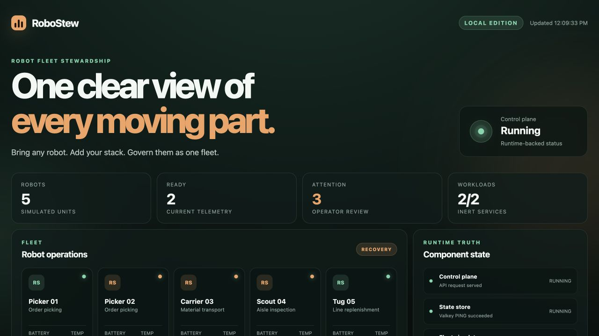

# RoboStew

**The open control plane for robot fleets.**

> Bring any robot. Add your stack. Govern them as one fleet.

RoboStew `v0.1.0` is a local-first engineering release that turns deterministic simulated robot telemetry, workload heartbeats, and functional probes into one honest fleet view. It runs without a cloud account and keeps AI optional.

Created and maintained by **Anatoli Fomenko** — [GitHub](https://github.com/afomenko) · [LinkedIn](https://www.linkedin.com/in/anatolifomenko)



## Start locally

Prerequisites:

- an Apple Silicon Mac;
- Git;
- Docker Desktop running.

```bash
git clone https://github.com/robostew-project/robostew.git
cd robostew
./robostew start
./robostew demo
```

Open `http://127.0.0.1:8080`.

The local stack contains five services:

- dashboard and control-plane API;
- Valkey state store;
- deterministic fleet simulator;
- inert visual-inspection workload;
- inert fleet-routing workload.

No host-installed database, Node.js, Python, cloud CLI, AI key, second machine, or Ubuntu virtual machine is required.

## What the demonstration proves

The fixed scenario moves five simulated robots through:

1. nominal operation;
2. thermal, battery, and heartbeat conditions requiring attention;
3. bounded recovery;
4. stable operation.

Runtime truth is backed by current Valkey, telemetry, and workload probes. If the simulator stops and telemetry becomes stale, the control plane reports degradation rather than leaving a static green indicator.

## What it does not prove

- No physical robot or motor is controlled.
- No safety-rated or real-time control is provided.
- The workloads are inert software services.
- AI is disabled in the local edition and has no deployment authority.
- The quickstart was validated on one Apple Silicon Mac only.
- Linux, Windows, Intel Mac, and other macOS configurations are untested for `v0.1.0`.

The containerized architecture may work elsewhere, but this release makes no support claim for those environments. Community test reports and contributions are welcome.

## Operate and remove

```bash
./robostew status
./robostew stop
./robostew start
./robostew uninstall
./robostew uninstall --purge
```

`uninstall` preserves the `robostew-data` Docker volume. `uninstall --purge` removes RoboStew containers, network, data volume, and the exact locally built `robostew/control-plane:0.1.0` image while leaving the repository, Docker Desktop, shared base images, and unrelated Docker resources untouched.

## Documentation

- [Quickstart](docs/QUICKSTART.md)
- [Installation and removal contract](docs/INSTALLATION-CONTRACT.md)
- [Architecture](docs/ARCHITECTURE.md)
- [Capability matrix](docs/CAPABILITY-MATRIX.md)
- [Security boundaries](docs/SECURITY-BOUNDARIES.md)
- [Troubleshooting](docs/TROUBLESHOOTING.md)
- [Known limitations](docs/LIMITATIONS.md)
- [Local validation evidence](docs/LOCAL-VALIDATION.md)
- [Azure/Dell/EVE reference deployment](docs/REFERENCE-DEPLOYMENT.md)

## Reference deployment

The separate reference architecture demonstrates an Azure-hosted control plane observing five inert workloads on LF Edge EVE running on a Dell Ubuntu host. Optional managed-identity AI and bounded NemoClaw/OpenShell paths were also validated privately.

That reference work is evidence of cloud/edge integration, not a one-command cloud installer and not evidence that the laptop edition supports Ubuntu.

The repository includes [tested reference implementations](reference/README.md) for runtime truth, server-side response projection, EVE inventory reconciliation, a bounded Azure OpenAI advisor, a NemoClaw/OpenShell request boundary, and authenticated telemetry intake. These modules are inspectable examples; they are not started by the local quickstart and do not recreate the private deployment.

## License

RoboStew is released under Apache License 2.0. Third-party components remain under their respective licenses.
