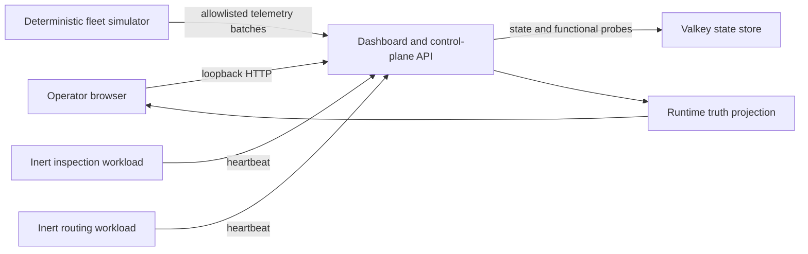

# RoboStew Architecture

RoboStew separates a runnable local core from a more capable cloud/edge reference deployment. The local core is the default public experience; the reference topology documents integration evidence without making the quickstart cloud-dependent.

## Local edition



All five services share the private `robostew-local` Docker network. Only the dashboard is published to the host, and it binds to `127.0.0.1` by default. Valkey, the simulator, and both workloads have no host port binding.

## Components

### Dashboard and control-plane API

- Serves the operator dashboard and allowlisted JSON APIs.
- Accepts deterministic telemetry and inert workload heartbeats.
- Builds public responses from explicit schemas.
- Reports functional state rather than configuration-only readiness.
- Uses browser security headers and loopback-only host exposure.

### Valkey state store

- Persists the current simulated fleet, workload inventory, and bounded event timeline.
- Uses a named RoboStew-owned volume.
- Is not exposed to the host network.
- Survives stop/start and non-purge uninstall workflows.

### Fleet simulator

- Generates five clearly labeled simulated robots.
- Runs a fixed four-stage scenario.
- Sends a quiet stable heartbeat between scenario runs so telemetry freshness remains truthful without flooding the timeline.
- Has no physical robot, host, cloud, or deployment interface.

### Inert workloads

- Demonstrate two workload identities and current heartbeat reporting.
- Run as unprivileged Node.js containers.
- Have no host mounts and no robot-control behavior.

## Runtime truth

The control plane computes its overall state from:

- a live Valkey `PING`;
- telemetry presence and freshness;
- two current workload heartbeats;
- the API request being served.

States use the shared vocabulary `available`, `configured`, `running`, `degraded`, `stopped`, and `unreachable`. The local AI component is truthfully `stopped` and optional.

## Data path

```text
fixed scenario
  -> allowlisted telemetry input
  -> server-side projection
  -> Valkey persistence
  -> runtime truth and fleet APIs
  -> browser dashboard
```

Arbitrary command strings, provider responses, host paths, usernames, private endpoints, and credentials are not part of the public API schema.

## Reference architecture

The separate Azure/Dell/EVE topology adds:

- an Azure Ubuntu controller host;
- Eden/Adam and Redis controller state in the separately validated reference environment;
- a private Dell Ubuntu/libvirt host;
- LF Edge EVE;
- five inert EVE workloads;
- optional managed-identity Azure AI advice;
- an optional bounded NemoClaw/OpenShell sandbox.

The reference deployment is not required by the local edition and has no kinetic robot-control authority. See `REFERENCE-DEPLOYMENT.md` for the validated boundary and limitations.

## Published reference source

The reviewed modules under [`reference/`](../reference/README.md) expose selected implementation patterns without copying the private deployment:

- conservative runtime-state derivation;
- recursive server-side response projection;
- EVE workload observation reconciliation;
- managed-identity, read-only AI request construction;
- fixed-request NemoClaw/OpenShell policy boundaries;
- loopback-first authenticated telemetry intake;
- private-by-default infrastructure and warm-standby contracts.

They contain no remote execution or workload-deployment path and are not dependencies of the five-service local stack.
