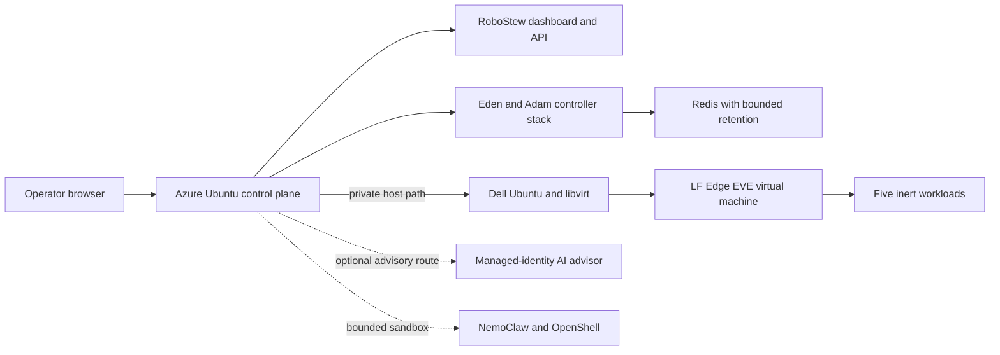

# Azure/Dell/EVE Reference Deployment

The reference deployment shows how RoboStew's control-plane ideas extend beyond the local simulator. It is separate from the default laptop edition and is not required for the five-to-ten-minute experience.

## Validated topology

## Privately validated evidence

- Azure Ubuntu controller services recovered after a full guest reboot.
- Dashboard runtime truth reported the live controller, Dell host, EVE node, and five current workloads.
- Redis exact retention and restart behavior were validated.
- Azure OpenAI returned bounded advisory responses through a dedicated managed identity, including a fresh validation on 2026-08-15.
- A dated private validation recorded one bounded NemoClaw/OpenShell inference request, a denied public-network request, and a denied unauthenticated broker request.
- Later provider-quota responses do not affect the local edition and are not presented as an availability guarantee for this optional reference path.
- The sandbox had no Docker socket, writable host mount, deployment authority, or robot-actuation authority.

## Deliberate publication boundary

Public material may include generic architecture, component responsibilities, secure deployment defaults, and transformed validation summaries. It must not include private addresses, usernames, resource names, identities, certificate material, recovery archives, VM disks, raw logs, or deployment-specific paths.

## Known gaps

- Complete Azure recreation from an empty resource group was not executed.
- No deployable infrastructure template is included; the repository documents security and warm-standby contracts only.
- Azure deallocation/start was not separately recorded from guest reboot.
- Dell host cold boot was not performed after EVE autostart was enabled, so unattended recovery remains unvalidated.
- The obsolete root-owned Dell observer was intentionally disabled and retired; the authoritative controller path does not depend on it.
- No physical robot or kinetic workload was demonstrated.

## Security position

The public deployment guide must use safer defaults than the private engineering environment: restricted SSH ingress, deny-by-default networks, modern TLS, managed identity, disabled registry admin credentials, restricted disk access, explicit backup, and scoped permissions.

The reference deployment demonstrates integration work. It is not a certified production architecture and does not expand the local edition's support matrix.

## Inspectable public patterns

Selected environment-independent logic is published under [`reference/`](../reference/README.md). It includes tests for runtime truth, server-side projection, EVE inventory reconciliation, bounded AI requests, NemoClaw/OpenShell negative policy behavior, and authenticated telemetry projection. It deliberately omits deployment commands, private endpoints, host identities, and recovery archives.
